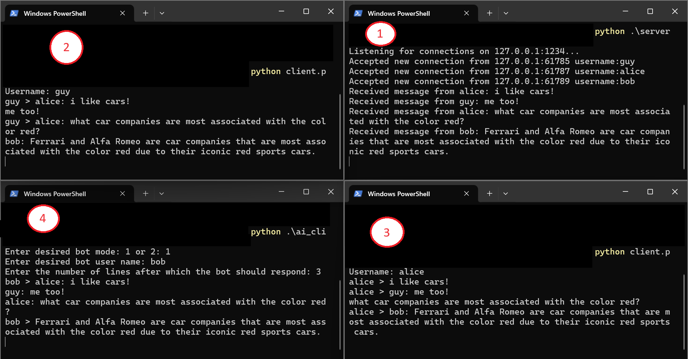
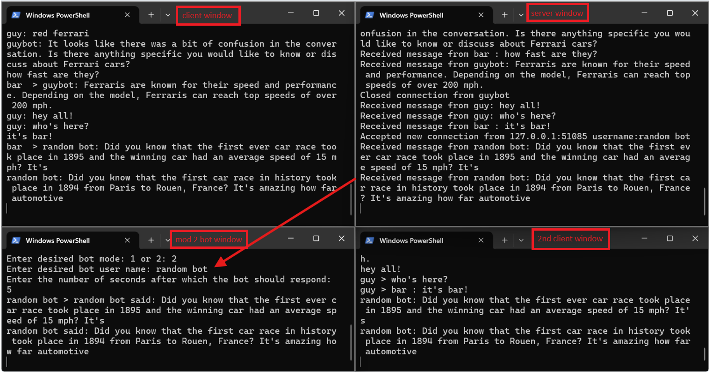

# Concurrent Chat System wiht Open Ai agents


### Table of Contents
- [Features](#Features)
- [Usage](#Usage)

## Overview
This project implements a simple chat system using Python, which consists of both a server and multiple clients. The system allows multiple clients to connect to the server, send messages, and receive messages from other connected clients.

## Features
### server: 
- Handles multiple clients concurrently using non-blocking sockets.
- Broadcasts incoming messages from a client to all other connected clients.
- Manages clients and connections using select.select() for efficient I/O.
### Client:
- Sends and receives messages concurrently by utilizing threading.
- Connects to the server and participates in chat with other clients.
- Follows the message protocol, ensuring each message starts with a fixed-length header indicating its length.
### Ai Clients:
#### mode1
- Respond every N lines: The bot reads the conversation and responds after every N lines.


#### mode2 
- Respond every N seconds: The bot generates random, unrelated responses after every N seconds.




### Message Protocol:
- A simple protocol where each message includes a fixed-length header containing the length of the actual message, ensuring proper message transmission between server and clients.

## Usage
1. Run the server 
```
python server.py
```

2. Run a client or an Ai agent
```
python client.py 
```
```
python ai_client.py 
```